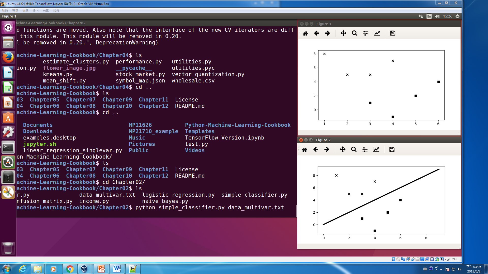
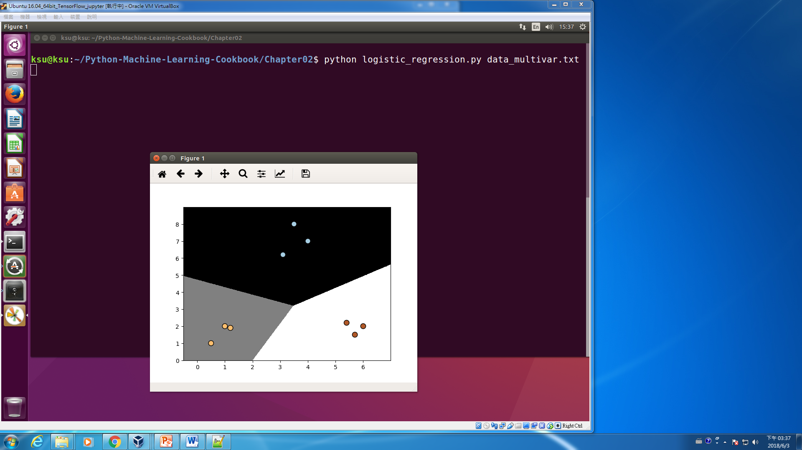
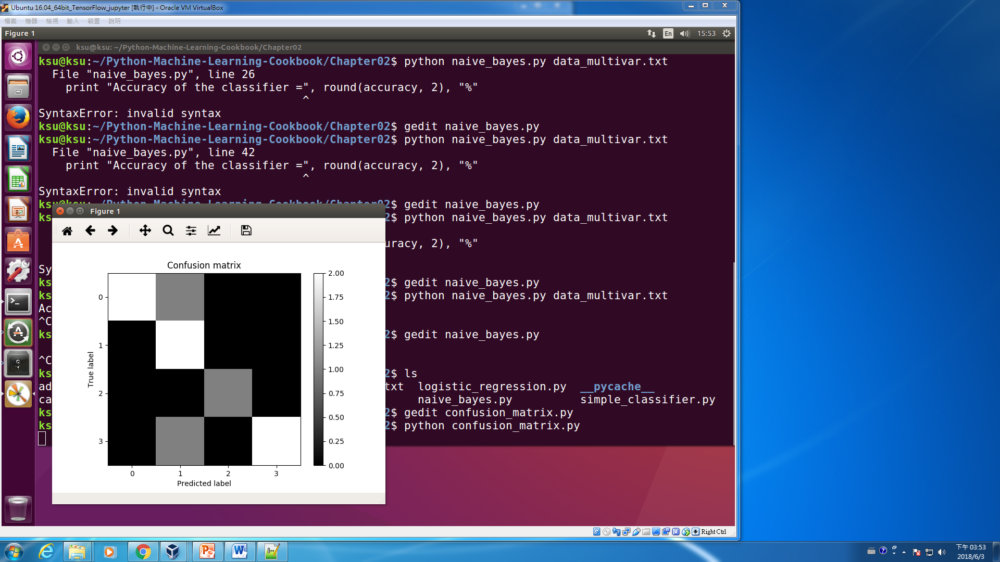
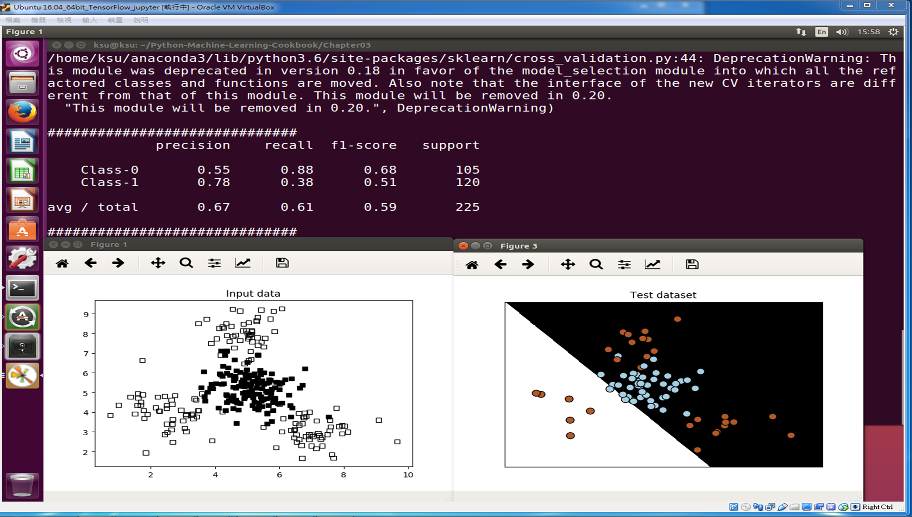

# 教科書
>* Python Machine Learning Cookbook: Prateek Joshi  June 2016
>* https://detail.tmall.com/item.htm?id=558284517556&ns=1&abbucket=19
>* https://www.packtpub.com/big-data-and-business-intelligence/python-machine-learning-cookbook
>* https://github.com/PacktPublishing/Python-Machine-Learning-Cookbook

>* 可以直接使用scikit-learn的文件直接教學
>* http://scikit-learn.org/stable/tutorial/index.html
>* http://scikit-learn.org/stable/supervised_learning.html#supervised-learning

# packages and modules

>* 本次上課所使用的教學環境:Ubuntu_16.04_64bit_TensorFlow_jupyter

>* http://scikit-learn.org/stable/
>* http://scikit-learn.org/stable/modules/preprocessing.html#preprocessing
>* https://www.cnblogs.com/chaosimple/p/4153167.html
>* https://blog.csdn.net/Dream_angel_Z/article/details/49406573
>* scikit-learn套件的preprocessing模組有許多寫好的函示如scale(),...
>* scale()把資料處理成mean為0,standard devistion為

```
ksu@ksu:~$ python
Python 3.6.0 |Anaconda 4.3.0 (64-bit)| (default, Dec 23 2016, 12:22:00) 
[GCC 4.4.7 20120313 (Red Hat 4.4.7-1)] on linux
Type "help", "copyright", "credits" or "license" for more information.
>>> from sklearn import preprocessing
>>> import numpy as np

>>> X_train = np.array([[ 1., -1.,  2.],
... ...                     [ 2.,  0.,  0.],
... ...                     [ 0.,  1., -1.]])
Traceback (most recent call last):
  File "<stdin>", line 2, in <module>
TypeError: 'ellipsis' object is not subscriptable

>>> X_train = np.array([[ 1., -1.,  2.],
... [ 2.,  0.,  0.],
... [ 0.,  1., -1.]])
>>> X_scaled = preprocessing.scale(X_train)
>>> X_scaled
array([[ 0.        , -1.22474487,  1.33630621],
       [ 1.22474487,  0.        , -0.26726124],
       [-1.22474487,  1.22474487, -1.06904497]])
>>> X_scaled.mean(axis=0)
array([ 0.,  0.,  0.])
>>> X_scaled.std(axis=0)
array([ 1.,  1.,  1.])

Scaled data has zero mean and unit variance
```

# 監督學習: Supervised Learning 

### 第1章 監督學習: Supervised Learning 

1.2 資料預處理技術==>preprocessing.py
```
import numpy as np
from sklearn import preprocessing

data = np.array([[ 3, -1.5,  2, -5.4],
                 [ 0,  4,  -0.3, 2.1],
                 [ 1,  3.3, -1.9, -4.3]])

#資料預處理常用技術===>preprocessing模組有許多寫好的函示
# mean removal(移除平均值)
data_standardized = preprocessing.scale(data)
print "\nMean =", data_standardized.mean(axis=0)
print "Std deviation =", data_standardized.std(axis=0)

# min max scaling(最小_最大_縮放)  see 4.3.1.1. Scaling features to a range
data_scaler = preprocessing.MinMaxScaler(feature_range=(0, 1))
data_scaled = data_scaler.fit_transform(data)
print "\nMin max scaled data:\n", data_scaled

# normalization(正規化)
"""
正則化的過程是將每個樣本縮放到單位範數(每個樣本的範數為1)，
如果要使用如二次型(點積)或者其它核方法計算兩個樣本之間的相似性這個方法會很有用。

該方法是文本分類和聚類分析中經常使用的向量空間模型（Vector Space Model)的基礎.

Normalization主要思想是對每個樣本計算其p-範數，然後對該樣本中每個元素除以該範數，
這樣處理的結果是使得每個處理後樣本的p-範數(l1-norm,l2-norm)等於1。
"""

data_normalized = preprocessing.normalize(data, norm='l1')
print "\nL1 normalized data:\n", data_normalized

# binarization(二元化處理)
data_binarized = preprocessing.Binarizer(threshold=1.4).transform(data)
print "\nBinarized data:\n", data_binarized

# one hot encoding
encoder = preprocessing.OneHotEncoder()
encoder.fit([[0, 2, 1, 12], [1, 3, 5, 3], [2, 3, 2, 12], [1, 2, 4, 3]])
encoded_vector = encoder.transform([[2, 3, 5, 3]]).toarray()
print "\nEncoded vector:\n", encoded_vector

4.3.1.3. Scaling data with outliers(極端值)
```

### 1.3 標記編碼方法==>label_encoder.py
```

import numpy as np
from sklearn import preprocessing

label_encoder = preprocessing.LabelEncoder()
input_classes = ['audi', 'ford', 'audi', 'toyota', 'ford', 'bmw']
label_encoder.fit(input_classes)

# print classes
print "\nClass mapping:"
for i, item in enumerate(label_encoder.classes_):
    print item, '-->', i

# transform a set of classes
labels = ['toyota', 'ford', 'audi']
encoded_labels = label_encoder.transform(labels)
print "\nLabels =", labels 
print "Encoded labels =", list(encoded_labels)

# inverse transform
encoded_labels = [2, 1, 0, 3, 1]
decoded_labels = label_encoder.inverse_transform(encoded_labels)
print "\nEncoded labels =", encoded_labels
print "Decoded labels =", list(decoded_labels)
```
### 1.4 創建線性回歸器==>linear_regression_singlevar.py


http://scikit-learn.org/stable/auto_examples/linear_model/plot_ols.html#sphx-glr-auto-examples-linear-model-plot-ols-py
```
print(__doc__)


# Code source: Jaques Grobler
# License: BSD 3 clause


import matplotlib.pyplot as plt
import numpy as np
from sklearn import datasets, linear_model
from sklearn.metrics import mean_squared_error, r2_score

# metrics評估指標==>http://scikit-learn.org/stable/modules/model_evaluation.html#model-evaluation
#Regression	 metrics評估指標	 
‘explained_variance’	metrics.explained_variance_score	 
‘neg_mean_absolute_error’	metrics.mean_absolute_error	 
‘neg_mean_squared_error’	metrics.mean_squared_error	 
‘neg_mean_squared_log_error’	metrics.mean_squared_log_error	 
‘neg_median_absolute_error’	metrics.median_absolute_error	 
‘r2’	metrics.r2_score


# Load the diabetes dataset
# http://lijiancheng0614.github.io/scikit-learn/modules/generated/sklearn.datasets.load_diabetes.html
diabetes = datasets.load_diabetes()


# Use only one feature只使用一個特徵值
diabetes_X = diabetes.data[:, np.newaxis, 2]

#把資料分成兩部分:訓練集+測試集
# Split the data into training/testing sets
diabetes_X_train = diabetes_X[:-20]
diabetes_X_test = diabetes_X[-20:]

# Split the targets into training/testing sets
diabetes_y_train = diabetes.target[:-20]
diabetes_y_test = diabetes.target[-20:]

# Create linear regression object
regr = linear_model.LinearRegression()

# Train the model using the training sets
regr.fit(diabetes_X_train, diabetes_y_train)

# Make predictions using the testing set
diabetes_y_pred = regr.predict(diabetes_X_test)

# The coefficients
print('Coefficients: \n', regr.coef_)
# The mean squared error
print("Mean squared error: %.2f"
      % mean_squared_error(diabetes_y_test, diabetes_y_pred))
# Explained variance score: 1 is perfect prediction
print('Variance score: %.2f' % r2_score(diabetes_y_test, diabetes_y_pred))
# 
print('mean_absolute_error: %.2f' % mean_absolute_error(diabetes_y_test, diabetes_y_pred))

# Plot outputs
plt.scatter(diabetes_X_test, diabetes_y_test,  color='black')
plt.plot(diabetes_X_test, diabetes_y_pred, color='blue', linewidth=3)

plt.xticks(())
plt.yticks(())

plt.show()
```


```
=========================================================
Linear Regression Example
=========================================================
This example uses the only the first feature of the `diabetes` dataset, in
order to illustrate a two-dimensional plot of this regression technique. The
straight line can be seen in the plot, showing how linear regression attempts
to draw a straight line that will best minimize the residual sum of squares
between the observed responses in the dataset, and the responses predicted by
the linear approximation.

The coefficients, the residual sum of squares and the variance score are also
calculated.


/home/ksu/anaconda3/lib/python3.6/site-packages/matplotlib/font_manager.py:280: 
UserWarning: Matplotlib is building the font cache using fc-list. This may take a moment.
  'Matplotlib is building the font cache using fc-list. '

Coefficients: 
 [ 938.23786125]
Mean squared error: 2548.07
Variance score: 0.47
```

>* scikit-learn關鍵程式碼解析
>* https://github.com/scikit-learn/scikit-learn/blob/master/sklearn/metrics/regression.py

```
def mean_squared_error(y_true, y_pred,
                       sample_weight=None,
                       multioutput='uniform_average'):
                       
    y_type, y_true, y_pred, multioutput = _check_reg_targets(
        y_true, y_pred, multioutput)
    check_consistent_length(y_true, y_pred, sample_weight)
    
    output_errors = np.average((y_true - y_pred) ** 2, axis=0,
                               weights=sample_weight)
    if isinstance(multioutput, string_types):
        if multioutput == 'raw_values':
            return output_errors
        elif multioutput == 'uniform_average':
            # pass None as weights to np.average: uniform mean
            multioutput = None

    return np.average(output_errors, weights=multioutput)
```

##### 線性回歸linear regression

##### 資料集:data_singlevar.txt
```
4.94,4.37
-1.58,1.7
-4.45,1.88
-6.06,0.56
-1.22,2.23
...............
```

##### 程式:linear_regression_singlevar.py
```
import sys

import numpy as np

filename = sys.argv[1]
X = []
y = []
with open(filename, 'r') as f:
    for line in f.readlines():
        xt, yt = [float(i) for i in line.split(',')]
        X.append(xt)
        y.append(yt)

# Train/test split
num_training = int(0.8 * len(X))
num_test = len(X) - num_training

# Training data
X_train = np.array(X[:num_training]).reshape((num_training,1))
y_train = np.array(y[:num_training])

# Test data
X_test = np.array(X[num_training:]).reshape((num_test,1))
y_test = np.array(y[num_training:])

# Create linear regression object
from sklearn import linear_model

linear_regressor = linear_model.LinearRegression()

# Train the model using the training sets
linear_regressor.fit(X_train, y_train)

# Predict the output
y_test_pred = linear_regressor.predict(X_test)

# Plot outputs
import matplotlib.pyplot as plt

plt.scatter(X_test, y_test, color='green')
plt.plot(X_test, y_test_pred, color='black', linewidth=4)
plt.xticks(())
plt.yticks(())
plt.show()

# Measure performance ### 1.5 計算回歸準確性
import sklearn.metrics as sm

print "Mean absolute error =", round(sm.mean_absolute_error(y_test, y_test_pred), 2) 
print "Mean squared error =", round(sm.mean_squared_error(y_test, y_test_pred), 2) 
print "Median absolute error =", round(sm.median_absolute_error(y_test, y_test_pred), 2) 
print "Explain variance score =", round(sm.explained_variance_score(y_test, y_test_pred), 2) 
print "R2 score =", round(sm.r2_score(y_test, y_test_pred), 2)

# Model persistence 1.6 保存模型資料
import cPickle as pickle

output_model_file = '3_model_linear_regr.pkl'

with open(output_model_file, 'w') as f:
    pickle.dump(linear_regressor, f)

with open(output_model_file, 'r') as f:
    model_linregr = pickle.load(f)

y_test_pred_new = model_linregr.predict(X_test)
print "\nNew mean absolute error =", round(sm.mean_absolute_error(y_test, y_test_pred_new), 2) 
```
##### 執行程式
```
python linear_regression_singlevar.py data_singlevar.txt
```

## 多元回歸

>* 1.7 創建ridge回歸器Building a ridge regressor==>
>* 1.8 創建多項式回歸器Building a polynomial regressor ==>

##### 資料集:data_multivar.txt
```
0.39,2.78,7.11,-8.07
1.65,6.7,2.42,12.24
5.67,6.38,3.79,23.96
2.31,6.27,4.8,4.29
3.67,6.67,2.38,16.37
3.64,3.14,2.38,12.44
7.0,3.85,8.39,13.45
```
##### 程式:regression_multivar.py
```
import sys

import numpy as np

filename = sys.argv[1]
X = []
y = []
with open(filename, 'r') as f:
    for line in f.readlines():
        data = [float(i) for i in line.split(',')]
        xt, yt = data[:-1], data[-1]
        X.append(xt)
        y.append(yt)

# Train/test split
num_training = int(0.8 * len(X))
num_test = len(X) - num_training

# Training data
#X_train = np.array(X[:num_training]).reshape((num_training,1))
X_train = np.array(X[:num_training])
y_train = np.array(y[:num_training])

# Test data
#X_test = np.array(X[num_training:]).reshape((num_test,1))
X_test = np.array(X[num_training:])
y_test = np.array(y[num_training:])

# Create linear regression object
from sklearn import linear_model

linear_regressor = linear_model.LinearRegression()
ridge_regressor = linear_model.Ridge(alpha=0.01, fit_intercept=True, max_iter=10000)

# Train the model using the training sets
linear_regressor.fit(X_train, y_train)
ridge_regressor.fit(X_train, y_train)

# Predict the output
y_test_pred = linear_regressor.predict(X_test)
y_test_pred_ridge = ridge_regressor.predict(X_test)

# Measure performance
import sklearn.metrics as sm

print "LINEAR:"
print "Mean absolute error =", round(sm.mean_absolute_error(y_test, y_test_pred), 2) 
print "Mean squared error =", round(sm.mean_squared_error(y_test, y_test_pred), 2) 
print "Median absolute error =", round(sm.median_absolute_error(y_test, y_test_pred), 2) 
print "Explained variance score =", round(sm.explained_variance_score(y_test, y_test_pred), 2) 
print "R2 score =", round(sm.r2_score(y_test, y_test_pred), 2)

print "\nRIDGE:"
print "Mean absolute error =", round(sm.mean_absolute_error(y_test, y_test_pred_ridge), 2) 
print "Mean squared error =", round(sm.mean_squared_error(y_test, y_test_pred_ridge), 2) 
print "Median absolute error =", round(sm.median_absolute_error(y_test, y_test_pred_ridge), 2) 
print "Explained variance score =", round(sm.explained_variance_score(y_test, y_test_pred_ridge), 2) 
print "R2 score =", round(sm.r2_score(y_test, y_test_pred_ridge), 2)

# Polynomial regression
from sklearn.preprocessing import PolynomialFeatures

polynomial = PolynomialFeatures(degree=10)
X_train_transformed = polynomial.fit_transform(X_train)
datapoint = [0.39,2.78,7.11]
poly_datapoint = polynomial.fit_transform(datapoint)

poly_linear_model = linear_model.LinearRegression()
poly_linear_model.fit(X_train_transformed, y_train)
print "\nLinear regression:\n", linear_regressor.predict(datapoint)
print "\nPolynomial regression:\n", poly_linear_model.predict(poly_datapoint)

# Stochastic Gradient Descent regressor
sgd_regressor = linear_model.SGDRegressor(loss='huber', n_iter=50)
sgd_regressor.fit(X_train, y_train)
print "\nSGD regressor:\n", sgd_regressor.predict(datapoint)
```

### 房屋價格的估算==>Estimating housing prices==>housing.py

>* 1.9 估算房屋價格Estimating housing prices 
>* 1.10 計算特徵的相對重要性Computing the relative importance of features
```
import numpy as np
from sklearn.ensemble import RandomForestRegressor, AdaBoostRegressor
from sklearn.tree import DecisionTreeRegressor
from sklearn import datasets
from sklearn.metrics import mean_squared_error, explained_variance_score
from sklearn.utils import shuffle
import matplotlib.pyplot as plt

def plot_feature_importances(feature_importances, title, feature_names):
    # Normalize the importance values 
    feature_importances = 100.0 * (feature_importances / max(feature_importances))

    # Sort the values and flip them
    index_sorted = np.flipud(np.argsort(feature_importances))

    # Arrange the X ticks
    pos = np.arange(index_sorted.shape[0]) + 0.5

    # Plot the bar graph
    plt.figure()
    plt.bar(pos, feature_importances[index_sorted], align='center')
    plt.xticks(pos, feature_names[index_sorted])
    plt.ylabel('Relative Importance')
    plt.title(title)
    plt.show()

if __name__=='__main__':
    # Load housing data
    housing_data = datasets.load_boston() 

    # Shuffle the data
    X, y = shuffle(housing_data.data, housing_data.target, random_state=7)

    # Split the data 80/20 (80% for training, 20% for testing)
    num_training = int(0.8 * len(X))
    X_train, y_train = X[:num_training], y[:num_training]
    X_test, y_test = X[num_training:], y[num_training:]

    # Fit decision tree regression model
    dt_regressor = DecisionTreeRegressor(max_depth=4)
    dt_regressor.fit(X_train, y_train)

    # Fit decision tree regression model with AdaBoost
    ab_regressor = AdaBoostRegressor(DecisionTreeRegressor(max_depth=4), n_estimators=400, random_state=7)
    ab_regressor.fit(X_train, y_train)

    # Evaluate performance of Decision Tree regressor
    y_pred_dt = dt_regressor.predict(X_test)
    mse = mean_squared_error(y_test, y_pred_dt)
    evs = explained_variance_score(y_test, y_pred_dt) 
    print "\n#### Decision Tree performance ####"
    print "Mean squared error =", round(mse, 2)
    print "Explained variance score =", round(evs, 2)

    # Evaluate performance of AdaBoost
    y_pred_ab = ab_regressor.predict(X_test)
    mse = mean_squared_error(y_test, y_pred_ab)
    evs = explained_variance_score(y_test, y_pred_ab) 
    print "\n#### AdaBoost performance ####"
    print "Mean squared error =", round(mse, 2)
    print "Explained variance score =", round(evs, 2)

    # Plot relative feature importances 
    plot_feature_importances(dt_regressor.feature_importances_, 
            'Decision Tree regressor', housing_data.feature_names)
    plot_feature_importances(ab_regressor.feature_importances_, 
            'AdaBoost regressor', housing_data.feature_names)
```


### 1.11 評估共用單車的需求分佈Estimating bicycle demand distribution==>bike_sharing.py

>* 問題:共享單車的需求分佈
>* 演算法:random forest regressor
```
import sys
import csv

import numpy as np
from sklearn.ensemble import RandomForestRegressor 
from sklearn import preprocessing
from sklearn.metrics import mean_squared_error, explained_variance_score
from sklearn.utils import shuffle
import matplotlib.pyplot as plt

from housing import plot_feature_importances

def load_dataset(filename):
    file_reader = csv.reader(open(filename, 'rb'), delimiter=',')
    X, y = [], []
    for row in file_reader:
        X.append(row[2:13])
        y.append(row[-1])

    # Extract feature names
    feature_names = np.array(X[0])

    # Remove the first row because they are feature names
    return np.array(X[1:]).astype(np.float32), np.array(y[1:]).astype(np.float32), feature_names

if __name__=='__main__':
    # Load the dataset from the input file
    X, y, feature_names = load_dataset(sys.argv[1])
    X, y = shuffle(X, y, random_state=7) 

    # Split the data 80/20 (80% for training, 20% for testing)
    num_training = int(0.9 * len(X))
    X_train, y_train = X[:num_training], y[:num_training]
    X_test, y_test = X[num_training:], y[num_training:]

    # Fit Random Forest regression model
    rf_regressor = RandomForestRegressor(n_estimators=1000, max_depth=10, min_samples_split=1)
    rf_regressor.fit(X_train, y_train)

    # Evaluate performance of Random Forest regressor
    y_pred = rf_regressor.predict(X_test)
    mse = mean_squared_error(y_test, y_pred)
    evs = explained_variance_score(y_test, y_pred) 
    print "\n#### Random Forest regressor performance ####"
    print "Mean squared error =", round(mse, 2)
    print "Explained variance score =", round(evs, 2)

    # Plot relative feature importances 
    plot_feature_importances(rf_regressor.feature_importances_, 'Random Forest regressor', feature_names)

```


# 第2章 創建分類器CONSTRUCTING A CLASSIFIER


## 2.2 建立簡單分類器Building a simple classifier ==> simple_classifier.py
```
import numpy as np
import matplotlib.pyplot as plt

# input data
X = np.array([[3,1], [2,5], [1,8], [6,4], [5,2], [3,5], [4,7], [4,-1]])

# labels
y = [0, 1, 1, 0, 0, 1, 1, 0]

# separate the data into classes based on 'y'
class_0 = np.array([X[i] for i in range(len(X)) if y[i]==0])
class_1 = np.array([X[i] for i in range(len(X)) if y[i]==1])

# plot input data
plt.figure()
plt.scatter(class_0[:,0], class_0[:,1], color='black', marker='s')
plt.scatter(class_1[:,0], class_1[:,1], color='black', marker='x')

# draw the separator line
line_x = range(10)
line_y = line_x

# plot labeled data and separator line 
plt.figure()
plt.scatter(class_0[:,0], class_0[:,1], color='black', marker='s')
plt.scatter(class_1[:,0], class_1[:,1], color='black', marker='x')
plt.plot(line_x, line_y, color='black', linewidth=3)

plt.show()
```


### 2.3 建立邏輯回歸分類器Building a logistic regression classifier==>logistic_regression.py
```
import numpy as np
from sklearn import linear_model 
import matplotlib.pyplot as plt

def plot_classifier(classifier, X, y):
    # define ranges to plot the figure 
    x_min, x_max = min(X[:, 0]) - 1.0, max(X[:, 0]) + 1.0
    y_min, y_max = min(X[:, 1]) - 1.0, max(X[:, 1]) + 1.0

    # denotes the step size that will be used in the mesh grid
    step_size = 0.01

    # define the mesh grid
    x_values, y_values = np.meshgrid(np.arange(x_min, x_max, step_size), np.arange(y_min, y_max, step_size))

    # compute the classifier output
    mesh_output = classifier.predict(np.c_[x_values.ravel(), y_values.ravel()])

    # reshape the array
    mesh_output = mesh_output.reshape(x_values.shape)

    # Plot the output using a colored plot 
    plt.figure()

    # choose a color scheme you can find all the options 
    # here: http://matplotlib.org/examples/color/colormaps_reference.html
    plt.pcolormesh(x_values, y_values, mesh_output, cmap=plt.cm.gray)

    # Overlay the training points on the plot 
    plt.scatter(X[:, 0], X[:, 1], c=y, s=80, edgecolors='black', linewidth=1, cmap=plt.cm.Paired)

    # specify the boundaries of the figure
    plt.xlim(x_values.min(), x_values.max())
    plt.ylim(y_values.min(), y_values.max())

    # specify the ticks on the X and Y axes
    plt.xticks((np.arange(int(min(X[:, 0])-1), int(max(X[:, 0])+1), 1.0)))
    plt.yticks((np.arange(int(min(X[:, 1])-1), int(max(X[:, 1])+1), 1.0)))

    plt.show()

if __name__=='__main__':
    # input data
    X = np.array([[4, 7], [3.5, 8], [3.1, 6.2], [0.5, 1], [1, 2], [1.2, 1.9], [6, 2], [5.7, 1.5], [5.4, 2.2]])
    y = np.array([0, 0, 0, 1, 1, 1, 2, 2, 2])

    # initialize the logistic regression classifier
    classifier = linear_model.LogisticRegression(solver='liblinear', C=100)

    # train the classifier
    classifier.fit(X, y)

    # draw datapoints and boundaries
    plot_classifier(classifier, X, y)
```




2.4 建立樸素貝葉斯分類器Building a Naive Bayes classifier==>naive_bayes.py
```
import numpy as np
import matplotlib.pyplot as plt
from sklearn.naive_bayes import GaussianNB 

from logistic_regression import plot_classifier

input_file = 'data_multivar.txt'

X = []
y = []
with open(input_file, 'r') as f:
    for line in f.readlines():
        data = [float(x) for x in line.split(',')]
        X.append(data[:-1])
        y.append(data[-1]) 

X = np.array(X)
y = np.array(y)

classifier_gaussiannb = GaussianNB()
classifier_gaussiannb.fit(X, y)
y_pred = classifier_gaussiannb.predict(X)

# compute accuracy of the classifier
accuracy = 100.0 * (y == y_pred).sum() / X.shape[0]
print("Accuracy of the classifier =")
round(accuracy, 2)
# print "Accuracy of the classifier =", round(accuracy, 2), "%"

plot_classifier(classifier_gaussiannb, X, y)

###############################################
# Train test split
from sklearn import cross_validation

X_train, X_test, y_train, y_test = cross_validation.train_test_split(X, y, test_size=0.25, random_state=5)
classifier_gaussiannb_new = GaussianNB()
classifier_gaussiannb_new.fit(X_train, y_train)
y_test_pred = classifier_gaussiannb_new.predict(X_test)

# compute accuracy of the classifier
accuracy = 100.0 * (y_test == y_test_pred).sum() / X_test.shape[0]
# print "Accuracy of the classifier =", round(accuracy, 2), "%"

plot_classifier(classifier_gaussiannb_new, X_test, y_test)

###############################################
# Cross validation and scoring functions

num_validations = 5
accuracy = cross_validation.cross_val_score(classifier_gaussiannb, 
        X, y, scoring='accuracy', cv=num_validations)
# print "Accuracy: " + str(round(100*accuracy.mean(), 2)) + "%"

f1 = cross_validation.cross_val_score(classifier_gaussiannb, 
        X, y, scoring='f1_weighted', cv=num_validations)
#print "F1: " + str(round(100*f1.mean(), 2)) + "%"

precision = cross_validation.cross_val_score(classifier_gaussiannb, 
        X, y, scoring='precision_weighted', cv=num_validations)
#print "Precision: " + str(round(100*precision.mean(), 2)) + "%"

recall = cross_validation.cross_val_score(classifier_gaussiannb, 
        X, y, scoring='recall_weighted', cv=num_validations)
#print "Recall: " + str(round(100*recall.mean(), 2)) + "%"


```


2.5 將資料集分割成訓練集和測試集Splitting the dataset for training and testing


2.6 用交叉驗證檢驗模型準確性Evaluating the accuracy using cross-validation


2.7 混淆矩陣視覺化Visualizing the confusion matrix
```
import numpy as np
import matplotlib.pyplot as plt
from sklearn.metrics import confusion_matrix

# Show confusion matrix
def plot_confusion_matrix(confusion_mat):
    plt.imshow(confusion_mat, interpolation='nearest', cmap=plt.cm.gray)
    plt.title('Confusion matrix')
    plt.colorbar()
    tick_marks = np.arange(4)
    plt.xticks(tick_marks, tick_marks)
    plt.yticks(tick_marks, tick_marks)
    plt.ylabel('True label')
    plt.xlabel('Predicted label')
    plt.show()

y_true = [1, 0, 0, 2, 1, 0, 3, 3, 3]
y_pred = [1, 1, 0, 2, 1, 0, 1, 3, 3]
confusion_mat = confusion_matrix(y_true, y_pred)
plot_confusion_matrix(confusion_mat)

# Print classification report
from sklearn.metrics import classification_report
target_names = ['Class-0', 'Class-1', 'Class-2', 'Class-3']
print classification_report(y_true, y_pred, target_names=target_names)
```




2.8 提取性能報告Extracting the performance report


2.9 根據汽車特徵評估品質Evaluating cars based on their characteristics


2.10 生成驗證曲線Extracting validation curves


2.11 生成學習曲線Extracting learning curves


2.12 估算收入階層Estimating the income bracket


### 第3章 預測建模PREDICTIVE MODELING

3.2 用SVM建立線性分類器Building a linear classifier using Support Vector Machine (SVMs)
3.3 用SVM建立非線性分類器Building a nonlinear classifier using SVMs
```
import numpy as np
import matplotlib.pyplot as plt

import utilities 

# Load input data
input_file = 'data_multivar.txt'
X, y = utilities.load_data(input_file)

###############################################
# Separate the data into classes based on 'y'
class_0 = np.array([X[i] for i in range(len(X)) if y[i]==0])
class_1 = np.array([X[i] for i in range(len(X)) if y[i]==1])

# Plot the input data
plt.figure()
plt.scatter(class_0[:,0], class_0[:,1], facecolors='black', edgecolors='black', marker='s')
plt.scatter(class_1[:,0], class_1[:,1], facecolors='None', edgecolors='black', marker='s')
plt.title('Input data')

###############################################
# Train test split and SVM training
from sklearn import cross_validation
from sklearn.svm import SVC

X_train, X_test, y_train, y_test = cross_validation.train_test_split(X, y, test_size=0.25, random_state=5)

params = {'kernel': 'linear'}
#params = {'kernel': 'poly', 'degree': 3}
#params = {'kernel': 'rbf'}
classifier = SVC(**params)
classifier.fit(X_train, y_train)
utilities.plot_classifier(classifier, X_train, y_train, 'Training dataset')

y_test_pred = classifier.predict(X_test)
utilities.plot_classifier(classifier, X_test, y_test, 'Test dataset')

###############################################
# Evaluate classifier performance

from sklearn.metrics import classification_report

target_names = ['Class-' + str(int(i)) for i in set(y)]
print "\n" + "#"*30
print "\nClassifier performance on training dataset\n"
print classification_report(y_train, classifier.predict(X_train), target_names=target_names)
print "#"*30 + "\n"

print "#"*30
print "\nClassification report on test dataset\n"
print classification_report(y_test, y_test_pred, target_names=target_names)
print "#"*30 + "\n"

plt.show()
```



##### 用SVM建立非線性分類器Building a nonlinear classifier using SVMs
```

```


3.4 解決類型數量不平衡問題Tackling class imbalance


3.5 提取置信度Extracting confidence measurements


3.6 尋找最優超參數Finding optimal hyperparameters


3.7 建立事件預測器Building an event predictor


3.8 估算交通流量Estimating traffic
```
```
